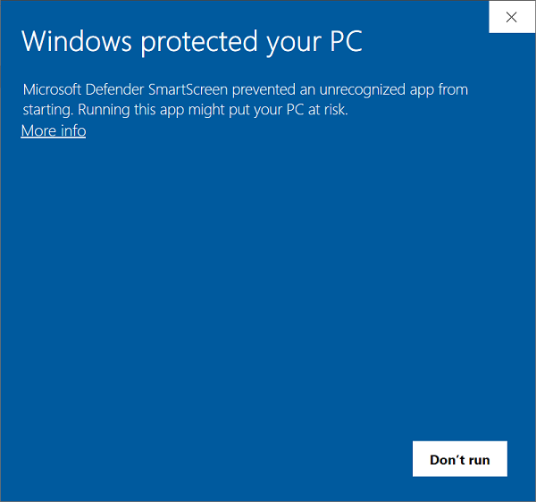
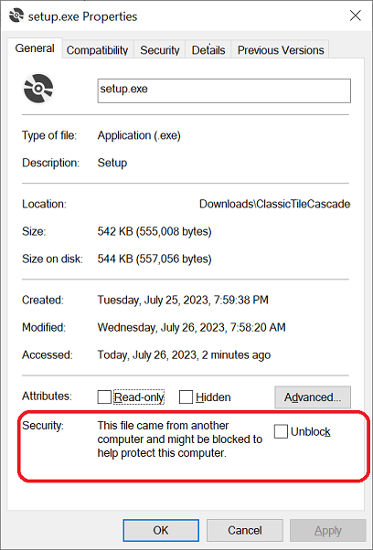
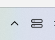
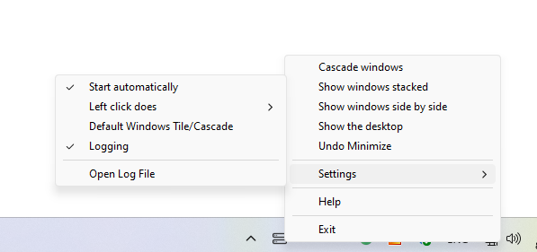

# Classic Tile & Cascade

Classic Tile & Cascade was created to restore the following actions to
the taskbar in Windows 11:

- Cascade windows

- Show the desktop

- Show windows side by side

- Show windows stacked

- Undo Minimize

These actions were available in Windows 10 and earlier versions of
Windows by right clicking any blank area on the toolbar and selecting
them from a context menu. This was removed in Windows 11 and users were
encouraged to use the alternative “Aero Snap” tiling features.

Windows 10 also introduced a behavior (most users would call it a “bug”)
when choosing “Show windows side by side“ or “Show windows stacked” from
the taskbar context menu whereby a blank space was often left on the
desktop. E.g., if there are two non-minimized windows, stacking those 2
Windows would only take up 2/3 of the desktop, with a blank area left at
the bottom of the desktop.

By default, Classic Tile & Cascade uses a customized algorithm to choose
the windows to tile or cascade which avoids this behavior. E.g., if
there are two non-minimized windows, stacking those 2 Windows would
result in each window covering ½ of the desktop. The usually buggy
default cascade/tile behavior carried over from Windows 10 can be
restored using the Settings menu should you prefer it or have any issues with the
customized algorithm.

## Dependencies & Installation (End User)
Classic Tile & Cascade works on Windows 10 and Windows 11. 

**To install:**
- Download the ClassicTileCascade-Install.zip for the latest release from 
my [GitHub Release Section](https://github.com/thf06037/ClassicTileCascade/releases)
- Unzip the file to a folder of your choosing
- Run Setup.exe

**Notes:**
- You may receive an warning such as the one below when trying to install Classic Tile & Cascade

- Should you receive this error, please:
    - Right click on Setup.exe
    - Check the "Unblock" box at the bottom of the property page
    - Rerun install by running Setup.exe

- See Troubleshooting/FAQ section below re: why you might receive this error
## Starting Classic Tile & Cascade

You can choose to start Classic Tile & Cascade automatically at login
from the Settings menu on the right-click context menu (Right-click \>
Settings \> Start Automatically)

Classic Tile & Cascade can also be started from its shortcut on the
Start menu (show all apps)

## Usage
**Basic Operation**

Classic Tile & Cascade runs as a Notification Icon in your “system
tray.”

You can do the following with this notification icon

<table>
<colgroup>
<col style="width: 24%" />
<col style="width: 75%" />
</colgroup>
<thead>
<tr class="header">
<th><strong>Operation</strong></th>
<th><strong>Result</strong></th>
</tr>
</thead>
<tbody>
<tr class="odd">
<td>Left-click on icon</td>
<td>
Invokes the default action. The default action can be chosen using “Settings
&gt; Left click does” from the context menu. Hovering the mouse over the
icon shows you the current default action.

The possible default actions are:

<ul>
<li>
Cascade windows
</li>
<li>
Show the desktop
</li>
<li>
Show windows side by side
</li>
<li>
Show windows stacked
</li>
<li>
Undo Minimize
</li>
</ul></td>
</tr>
<tr class="even">
<td>Right-click on icon</td>
<td>
Displays the context menu. From here you can:

<ul>
<li>
Choose a cascade/tile action. Choices are:

<ul>
<li>
Cascade windows
</li>
<li>
Show the desktop
</li>
<li>
Show windows side by side
</li>
<li>
Show windows stacked
</li>
<li>
Undo Minimize
</li>
</ul></li>
<li>
Open the Settings menu
</li>
<li>
Open online help
</li>
<li>
Exit the application and remove the notification icon
</li>
</ul></td>
</tr>
<tr class="odd">
<td>Hover mouse over icon</td>
<td>Shows you the current default action.</td>
</tr>
</tbody>
</table>

**Settings Menu**

The Settings menu on the right-click context menu (Right-click \>
Settings) controls Classic Tile & Cascade’s behavior.

The following settings are available:

<table>
<colgroup>
<col style="width: 24%" />
<col style="width: 75%" />
</colgroup>
<thead>
<tr class="header">
<th><strong>Setting</strong></th>
<th><strong>Description</strong></th>
</tr>
</thead>
<tbody>
<tr class="odd">
<td>Start automatically</td>
<td><ul>
<li>
<strong>Checked -</strong> Classic Tile &amp; Cascade will start
automatically at user login
</li>
<li>
<strong>Unchecked -</strong> Classic Tile &amp; Cascade will not
start automatically at user login
</li>
</ul></td>
</tr>
<tr class="even">
<td>Left click does</td>
<td>
Shows a submenu that lets you choose the left click default
action.

The possible default actions are:

<ul>
<li>
Cascade windows
</li>
<li>
Show the desktop
</li>
<li>
Show windows side by side
</li>
<li>
Show windows stacked
</li>
<li>
Undo Minimize
</li>
</ul></td>
</tr>
<tr class="odd">
<td>Default Windows Tile/Cascade</td>
<td><ul>
<li>
<strong>Checked –</strong> the default windows tile and cascade
functions are used
</li>
<li>
<strong>Unchecked -</strong> Classic Tile &amp; Cascade uses an
internal algorithm to determine which windows to tile or cascade. This
algorithm approximates the list of non-minimized windows that would show
up in the ALT-Tab switcher menu.
</li>
</ul>

It’s recommended to <b>uncheck</b> this setting unless you are having
problems with the internal algorithm behavior. Please see the
Troubleshooting section for some scenarios where you might wish to check
or uncheck this setting.
</td>
</tr>
<tr class="even">
<td>Logging</td>
<td><ul>
<li>
<strong>Checked –</strong> log errors and other information to a
file log
</li>
<li>
<strong>Unchecked –</strong> do not log errors and other
information to a file log
</li>
</ul>

The log can be found at this location on your PC: %LOCALAPPDATA%\
ClassicTileCascade.log

Enabling logging is only necessary if you are having issues with
Classic Tile &amp; Cascade
</td>
</tr>
</tbody>
</table>

## Troubleshooting/FAQ

**I don’t see Classic Tile & Cascade in my system tray**

Ensure that you have switched Classic Tile & Cascade “on” under the
“Other system tray icons” Windows settings.

To access this setting (Windows 11):

1.  Right click on the taskbar and choose “Taskbar settings”

2.  Expand the “Other system tray icons” section on the settings page

3.  Find “ClassicTileCascade” and switch it “on”

**Tiling the windows leaves a blank space on the desktop**

Try unchecking “Default Windows Tile/Cascade” in settings: Right-click
on icon \> Settings \> Default Windows Tile/Cascade.

**Some windows aren’t tiled when I tile the windows**

Try checking “Default Windows Tile/Cascade” in settings: Right-click
on icon \> Settings \> Default Windows Tile/Cascade.

**Why do I get a warning from my antivirus and/or Windows system when I try to install Classic Tile & Cascade?**

The only way to avoid this warning would be for me to purchase a code signing security certificate and using it to sign the 
executables for the project. This is beyond my budget for this project (both in terms of time and money). 
There is no malicious code in this application and the full source code for this project is 
[available online](https://github.com/thf06037/ClassicTileCascade). If you are concerned about the security of this app, 
please definitely run Setup.exe and the MSI of the installer through an antivirus scan before executing Setup.exe.

## Getting Help
If you have questions, concerns, bug reports, etc, please file an issue in [this repository](https://github.com/thf06037/ClassicTileCascade)'s Issue Tracker.

## Contributing
I'm currently mainly looking for people to test the application on a variety of PCs and let me know (via the Issue Tracker) whether 
they encounter any bugs or issues with the app.

I am open to pull requests for adding new features, etc. Please note that I may not be able to review these quickly.

## About The Code
Classic Tile & Cascade's source code is available in [this GitHub repository](https://github.com/thf06037/ClassicTileCascade).

Classic Tile & Cascade is written in C++ using native Windows libraries. 
I have not used any UI frameworks such as MFC, WTL, or WinRT.

The main directories are:
- ClassicTileCascade: Top level directory with solution (.SLN) file, License and Readme files
- ClassicTileCascade\ClassicTileCascade: The C++ source code for the ClassicTileCascade.exe that implements the
notification icon
- ClassicTileCascade\ClassicTileCascadeHelp: The source files and compiled help (CHM) file
for the project's HTML Help 
- ClassicTileCascade\ClassicTileCascadeSetup: The project file (*.vdproj) for the Visual Studio install project
that creates the MSI and Setup.exe file for the install 

It was written and compiled/linked using Microsoft Visual Studio Community 2022 (64-bit) - Current
Version 17.6.3.

To rebuild the project fully from the command line (including the main C++ executable project, installation project, 
and the HTML Help CHM file - requires Visual Studio), 
CD to the top level code directory and run the following:

`devenv ClassicTileCascade.sln /rebuild "Release|x86" /project "ClassicTileCascadeSetup\ClassicTileCascadeSetup.vdproj"`

The HTML Help for the project was developed and built (CHM file) 
using HTML Help Workshop. 
You can download HTML Help Workshop for free [here](https://web.archive.org/web/20210126113408/https://www.microsoft.com/en-us/download/details.aspx?id=21138).
You only need to download & install htmlhelp.exe from that page.

The HTML Help CHM will be built automatically by a regular build/rebuild of the solution. 
Should you wish to compile the CHM seperately from the project via the command line, 
CD to the ClassicTileCascadeHelp directory and run the following:

`hhc ClassicTileCascadeHelp.hhp`

## About Me And Why I Created This Project
**About me**

I created all of the code and help, etc. for this project as an "individual coder."

I have been in software development my entire career and played roles as a software developer, 
business analyst, IT project manager, and IT middle and executive manager. 

**Why I created this project**

A few main reasons:

1. I recently moved my main home PC to Windows 11 and wanted the classic tile and cascade functionality from 
Windows 10 back. The "Aero Snap" approach (which is the only windows arrangement approach on Windows 11
out of the box) has several shortcomings. 

2. I also wanted to fix the tile and cascade functionality that worked
fine in Windows 7, but was broken by Windows 10 (see above).

3. I have little or no time in my current IT role for hands on coding. But I miss coding so badly! In my 
coding heyday (ca. 1996-2006), I developed mostly in Win32 C++ (MFC, COM/DCOM, ATL), Visual Basic 6, and 
Java. In this project I wanted to:
    i. Learn more about how C++ has developed and change in the last 15 years. Particularly wanted to 
get exposed to the language changes that C++ 11 brought about. **My observation**: I was really blown away
by the scope of change to C++ in the last 10+ years!! So much so that I found it really hard to 
leverage all of the new functionality in a "hand's on" project. This project inspired me
to order Scott Meyer's "Effective Modern C++" book to get a deeper perspective.
    ii. See whether Win32 programming in C/C++ had changed much in the last 15 years. **My observation**: Very 
little change. I was able to pick things up basically where I left them those many years ago. Based on what is 
available online, most developers have understandably moved to C#/WinForms/WPF for this type of project.
    iii. Learn about modern source code control using Git and Github. **My observation**: Git is easy to get 
started with (especially with Visual Studio integration), but an absolute beast to master. I probably spent
more time figuring out how to get certain things done in Git 
than anything else on the project. I have barely scratched the surface.
    iv. Learn about the non-technical aspects of Open Source projects, including licensing, collaboration,
code signing, etc. **My observation**: There are a tremendous amount of good resources online for this, but many of them
are geared towards organizations rather than indivdual coders. 

    
## License

Classic Tile & Cascade - Copyright (C) 2023 thf

Classic Tile & Cascade is free software with open source.

The code is under the MIT license

Read file [License.txt](LICENSE.txt) for full information about license.

Note: You can use Classic Tile & Cascade on any computer, including a
computer in a commercial organization. You don't need to register or pay
for Classic Tile & Cascade.

## Credits and references
Classic Tile & Cascade uses the [log.c](https://github.com/rxi/log.c) open source library:
A simple logging library implemented in C99. Copyright (c) 2020 rxi. Used in accordance with
the MIT License.

 I was guided by several blog entries from Raymond Chen's fantastic [oldnewthing blog](https://devblogs.microsoft.com/oldnewthing/).
 Particularly helpful was the blog entry ["Which windows appear in the Alt+Tab list?,"](https://devblogs.microsoft.com/oldnewthing/20071008-00/?p=24863) 
 which helped me to develop the custom algorithm used for tiling and cascading windows 
 in the same way that these functions worked pre-Windows-10. 